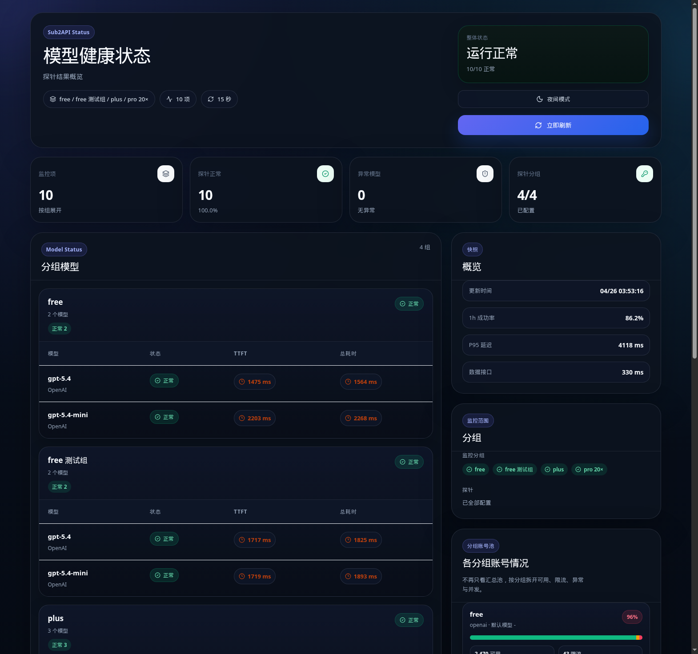

# statusCheck

statusCheck 是一个面向 **Sub2API** 部署的只读健康状态页。它把 Sub2API 的分组、账号池、运行指标和可选的真实模型探针聚合成一个适合公开展示的 Web 页面，同时提供一个隐藏的 token 鉴权管理页用于调整展示范围与探针配置。

- 后端：FastAPI、httpx、uv、Pydantic Settings
- 前端：React、TypeScript、Vite
- 部署：单容器 Docker Compose，FastAPI 直接托管前端静态产物
- 默认口径：公开页面只读、公开 API 默认隐藏运营敏感字段

## 在线预览

公网参考站点：[https://status.devbin.de/](https://status.devbin.de/)

> 参考站点只暴露公开只读状态页；隐藏的 `/admin` 页面需要 `ADMIN_TOKEN`。公开接口默认不会返回真实密钥、成本、请求量、token 量、用户数、API key 数、quota 和底层请求计数等运营隐私字段。



## 功能特性

### 分组优先的健康视图

- 按 Sub2API 分组拆开展示模型探针结果，避免多个分组混在一张表里难以定位问题。
- 每个分组独立展示账号总量、可用账号、限流账号、异常账号和当前并发。
- 支持只展示指定分组，也支持默认排除 `is_exclusive=true` 的私有组。

### 可选真实模型探针

- 支持使用 public API key 对模型进行轻量请求探测。
- 支持全局 fallback key，也支持按分组配置不同 key。
- 支持按分组覆盖要探测的模型列表。
- 支持 `chat_completions` 和 `responses` 两种探针入口。
- 探针模型来源可从分组模型、手动配置、历史用量、模型目录中组合。

### 隐藏管理页

- `/admin` 没有公开入口，需要手动输入路径访问。
- 所有 admin API 都要求 `Authorization: Bearer <ADMIN_TOKEN>`。
- 支持在线修改分组范围、账号扫描、探针模型、探针 key、刷新周期、公开字段和首页卡片。
- Docker Compose 部署时会把配置写回挂载的 `.env`，保存后立即刷新运行配置。

### 公开展示控制

- `/api/dashboard` 默认只保留适合公开展示的字段。
- 可在 `/admin` 的“公开展示”里决定哪些敏感字段允许进入公开 API。
- 首页卡片也可独立开关，适合把同一个项目用于公开展示或内部监控。
- 支持系统主题自动识别和手动浅色 / 深色切换。

## 架构

```text
Browser
  ├─ GET /                         # React 状态页
  ├─ GET /admin                    # 隐藏配置页
  ├─ GET /api/dashboard            # 公开只读聚合数据
  └─ GET/PUT /api/admin/config     # Bearer token 鉴权
        │
        ▼
FastAPI statusCheck
  ├─ 周期刷新 dashboard cache
  ├─ 调用 Sub2API admin API 读取分组、账号池、统计数据
  ├─ 可选调用 Sub2API public API 做模型探针
  └─ 按 PUBLIC_DASHBOARD_* 策略过滤公开字段
        │
        ▼
Sub2API
```

## 快速开始

### Docker Compose（推荐）

```bash
git clone https://github.com/yuqie6/statusCheck.git
cd statusCheck
cp .env.example .env
```

编辑 `.env`，至少填写：

```env
SUB2API_ADMIN_API_KEY=your-sub2api-admin-api-key
ADMIN_TOKEN=change-me-to-a-long-random-token
```

如果 Sub2API 跑在宿主机 `18081` 端口，Compose 默认会使用：

```env
DOCKER_SUB2API_BASE_URL=http://host.docker.internal:18081
```

启动：

```bash
docker compose up -d --build
```

查看状态：

```bash
docker compose ps
docker compose logs -f statuscheck
```

默认访问：

- 状态页：`http://127.0.0.1:38481/`
- 管理页：`http://127.0.0.1:38481/admin`
- 健康检查：`http://127.0.0.1:38481/api/healthz`

如需修改宿主机暴露端口：

```env
STATUSCHECK_PORT=38481
```

### 本地开发

后端：

```bash
cp .env.example .env
uv sync
uv run uvicorn app.main:app --reload --host 0.0.0.0 --port 38481
```

前端：

```bash
cp frontend/.env.example frontend/.env
npm --prefix frontend install
npm --prefix frontend run dev
```

开发地址：

- 前端 dev server：`http://127.0.0.1:38482`
- 后端 API：`http://127.0.0.1:38481/api/dashboard`

`frontend/.env` 默认建议保持同源代理口径：

```env
VITE_API_BASE_URL=
VITE_AUTO_REFRESH_MS=15000
```

## 配置说明

### 基础配置

| 变量 | 默认值 | 说明 |
| --- | --- | --- |
| `HOST` | `0.0.0.0` | FastAPI 监听地址 |
| `PORT` | `38481` | FastAPI 容器内监听端口 |
| `APP_ENV` | `development` | 运行环境标识 |
| `ALLOWED_ORIGINS` | `http://127.0.0.1:38482,http://localhost:38482` | 开发环境 CORS 白名单 |
| `ADMIN_TOKEN` | 空 | `/api/admin/*` Bearer token。生产必须配置长随机值 |
| `STATUSCHECK_PORT` | `38481` | Docker Compose 暴露到宿主机的端口 |
| `DOCKER_SUB2API_BASE_URL` | `http://host.docker.internal:18081` | 容器访问宿主机 Sub2API 的地址 |

### Sub2API 连接与分组范围

| 变量 | 默认值 | 说明 |
| --- | --- | --- |
| `SUB2API_BASE_URL` | `http://127.0.0.1:18081` | Sub2API 地址，本地开发使用 |
| `SUB2API_ADMIN_API_KEY` | 空 | Sub2API admin key，会通过 `x-api-key` 请求头发送 |
| `SUB2API_TIMEOUT_SECONDS` | `20` | 调用 Sub2API admin API 的超时时间 |
| `SUB2API_GROUP_IDS` | 空 | 逗号分隔的分组 ID。留空时自动读取公开组 |
| `SUB2API_INCLUDE_EXCLUSIVE_GROUPS` | `false` | 留空自动读取分组时，是否包含私有组 |

### 缓存与账号扫描

| 变量 | 默认值 | 说明 |
| --- | --- | --- |
| `DASHBOARD_CACHE_TTL_SECONDS` | `60` | dashboard 聚合缓存刷新周期 |
| `ACCOUNT_SCAN_ENABLED` | `false` | 是否启用较慢的账号分页扫描 |
| `ACCOUNT_SCAN_TTL_SECONDS` | `180` | 账号扫描缓存 TTL |
| `ACCOUNT_SCAN_PAGE_SIZE` | `100` | 每页扫描数量 |
| `ACCOUNT_SCAN_MAX_PAGES` | `0` | 最大扫描页数，`0` 表示不限制 |

### 模型探针

| 变量 | 默认值 | 说明 |
| --- | --- | --- |
| `SUB2API_MONITOR_API_KEY` | 空 | 全局 public API key，可作为 fallback |
| `SUB2API_MONITOR_GROUP_API_KEYS` | 空 | 分组 key 映射，例如 `2=sk-xxx,6=sk-yyy`，也支持一行一个 |
| `SUB2API_MONITOR_MODELS` | `gpt-5.4,gpt-5.4-mini,claude-sonnet-4-6,google/gemini-3-flash-preview` | 手动配置的候选探针模型 |
| `SUB2API_MONITOR_GROUP_MODELS` | 空 | 按分组覆盖模型，例如 `2=gpt-5.4,gpt-5.4-mini;6=gpt-5.4-mini` |
| `SUB2API_MONITOR_MODEL_SOURCES` | `groups,configured` | 模型来源，可选 `groups`、`configured`、`usage`、`catalog` |
| `SUB2API_MONITOR_USAGE_MODEL_LIMIT` | `10` | 从历史用量提取模型时的数量上限 |
| `SUB2API_MONITOR_TIMEOUT_SECONDS` | `18` | 单个探针请求超时 |
| `SUB2API_MONITOR_MAX_TOKENS` | `8` | 探针请求输出 token 上限 |
| `SUB2API_MONITOR_TEMPERATURE` | `0` | 探针请求 temperature |
| `SUB2API_MONITOR_PROMPT` | `Reply with OK only.` | 探针 prompt |
| `SUB2API_MONITOR_CONCURRENCY` | `3` | 探针并发 |
| `SUB2API_MONITOR_PROBE_ENDPOINT` | `chat_completions` | 可选 `chat_completions` 或 `responses` |

### 公开字段与首页卡片

| 变量 | 默认值 | 说明 |
| --- | --- | --- |
| `PUBLIC_DASHBOARD_FIELDS` | 空 | 允许进入 `/api/dashboard` 的敏感字段集合 |
| `PUBLIC_DASHBOARD_CARDS` | `metric_monitor_items,metric_healthy_models,metric_abnormal_models,metric_probe_groups,model_groups,snapshot,scope,group_pool,insights` | 首页展示卡片集合 |

`PUBLIC_DASHBOARD_FIELDS` 支持以下值，默认全部关闭：

| 值 | 含义 |
| --- | --- |
| `costs` | 成本字段，例如今日成本、累计成本、7 日成本趋势 |
| `request_volume` | 请求量、RPM、QPS 和请求趋势 |
| `token_volume` | TPM、TPS、token 趋势和模型 token 量 |
| `api_keys` | API key 数量 |
| `users` | 活跃用户数 |
| `quota` | 额度估算 |
| `model_usage` | 模型 7 日用量字段 |
| `ops_counts` | 底层成功、失败、总请求计数 |

`PUBLIC_DASHBOARD_CARDS` 支持以下值：

| 值 | 首页区域 |
| --- | --- |
| `metric_monitor_items` | 顶部“监控项”指标 |
| `metric_healthy_models` | 顶部“探针正常”指标 |
| `metric_abnormal_models` | 顶部“异常模型”指标 |
| `metric_probe_groups` | 顶部“探针分组”指标 |
| `model_groups` | 分组模型探针表 |
| `snapshot` | 右侧快照卡片 |
| `scope` | 右侧监控范围卡片 |
| `group_pool` | 分组账号池卡片 |
| `insights` | 告警 / 提醒卡片 |

## API

| 路径 | 鉴权 | 说明 |
| --- | --- | --- |
| `GET /api/healthz` | 无 | 服务健康状态 |
| `GET /api/dashboard` | 无 | 公开只读 dashboard 数据，已按公开策略过滤 |
| `GET /api/admin/config` | Bearer `ADMIN_TOKEN` | 读取当前 admin 配置和可选分组 |
| `PUT /api/admin/config` | Bearer `ADMIN_TOKEN` | 写回 `.env` 并刷新运行配置 |

## 安全边界

statusCheck 可以作为公开状态页使用，但需要明确以下边界：

- `/admin` 隐藏入口不是安全边界，必须设置强随机 `ADMIN_TOKEN`。
- 不要把真实 `.env`、`frontend/.env`、public API key 或 Sub2API admin key 提交到仓库。
- Docker Compose 会把宿主机 `.env` 挂载为容器内 `/app/.env`；admin 保存配置时会修改这份文件。
- `/api/dashboard` 默认隐藏运营敏感字段；如需公开，必须在 `/admin` 或 `PUBLIC_DASHBOARD_FIELDS` 中显式开启。
- `/api/*` 响应默认带 `Cache-Control: no-store`，避免中间层缓存状态数据。
- 后端默认附加以下安全响应头：
  - `Content-Security-Policy`
  - `X-Content-Type-Options: nosniff`
  - `X-Frame-Options: DENY`
  - `Referrer-Policy: no-referrer`
  - `Permissions-Policy`
  - `Cross-Origin-Opener-Policy`

## 构建与检查

```bash
uv run ruff check app
python3 -m compileall app
npm --prefix frontend run build
```

生产模式下也可以只构建前端，再由 FastAPI 托管 `frontend/dist`：

```bash
npm --prefix frontend run build
uv run uvicorn app.main:app --host 0.0.0.0 --port 38481
```

## 常见问题

### 为什么公开 API 里没有成本、请求量或 token 字段？

这是默认安全策略。公开状态页优先展示健康状态、账号数量、可用率、延迟和模型探针结果；成本、请求量、token、quota、用户数、API key 数和底层请求计数需要在 `/admin` 的“公开展示”里显式开启。

### 为什么模型探针没有结果？

确认以下配置：

1. `SUB2API_MONITOR_API_KEY` 或 `SUB2API_MONITOR_GROUP_API_KEYS` 已配置。
2. 对应 public API key 有权限访问待探测模型。
3. `SUB2API_MONITOR_GROUP_MODELS` 或 `SUB2API_MONITOR_MODELS` 中有有效模型名。
4. `SUB2API_MONITOR_PROBE_ENDPOINT` 与你的 Sub2API public API 兼容。

### 为什么 Docker 容器连不上宿主机 Sub2API？

Compose 默认使用：

```env
DOCKER_SUB2API_BASE_URL=http://host.docker.internal:18081
```

并配置了：

```yaml
extra_hosts:
  - "host.docker.internal:host-gateway"
```

如果 Sub2API 不在宿主机 `18081`，请改成实际可从容器访问的地址。

## License

见 [LICENSE](LICENSE)。
